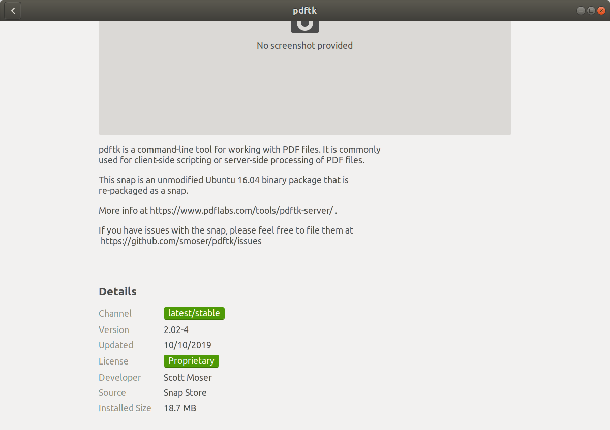

.. _app_install_non_standard:

Alternative la instalarea și dezinstalarea aplicațiilor
=======================================================

Așa cum am văzut în secțiunea :ref:`app_install_install_uninstall`, distribuțiile Linux dispun de un sistem de gestiune a pachetelor software (*(software) package management system*).
Acesta oferă unul sau mai multe depozite de pachete (*repository*) și utilitare specializate pentru gestiunea acestora (precum ``apt`` pe distribuțiile bazate pe Debian).
Cu ajutorul acestor utilitare instalăm pachete din repository, sau le dezinstalăm.

Folosirea unui sistem de gestiune a pachetelor ușurează experiența utilizatorului.
Utilizatorul nu mai trebuie să caute pe Internet un pachet, nu mai trebuie să se asigure că este versiunea compatibilă; sistemul de gestiune face aceste lucruri pentru utilizator.

Cu toate acestea, sistemul de gestiune a pachetelor specific distribuției are dezavantaje:

* Un pachet căutat nu se găsește în depozit din diferite rațiuni: nu este compatibil cu alte pachete, are probleme de licențiere sau, pur și simplu, nu a fost adăugat de distribuție.
* O versiune mai actuală a pachetului, necesară utilizatorului, nu se găsește în depozit.
* Instalarea unei versiuni mai noi a pachetului, dintr-un alt repository, poate produce probleme de dependență cu alte pachete instalate.
* Actualizarea unui pachet poate necesita actualizarea multor pachete sau chiar a întregii distribuții.

De acceea, există alte moduri de instala aplicații necesare utilizatorului:

#. Instalarea unui aplicații manual, direct de la furnizorul acestuia, prin descărcarea pachetului software corespunzător și instalarea sa.
#. Instalarea unei aplicații din surse.
#. Folosirea unor sisteme alternative de gestiune a pachetelor.

Instalarea manuală sau din surse a unei aplicații (opțiunea 1 și optiunea 2) sunt operații mai complicate care nu mențin avantajele sistemului de gestiune al pachetelor.
De aceea, din punctul de vedere al ușurinței instalării, dezinstalării și gestiunii aplicațiilor, este de preferat să folosim opțiunea 3, adică sisteme alternative de gestiune a pachetelor.
Sistemele alternative de gestiune a pachetelor oferă o interfață similară cu sistemele de gestiune a pachetelor specifice distribuției fără dezavantajele acestora.
Sisteme alternative sunt `Snap <https://snapcraft.io/>`_, `Flatpak <https://www.flatpak.org/>`_, `AppImage <https://appimage.org/>`_.
Aici vom folosi Snap; interfața de folosire este, însă, similară pentru Flatpak și AppImage [#snap_flatpak_appimage]_; mai mult, este apropiată de utilitare de gestiune a pachetelor (precum ``apt``).

Instalarea folosind Snap
------------------------

Utilitarul ``pdftk``, pentru gestiunea fișierelor PDF, nu se găsește în depozitul distribuției Ubuntu.
Dar se găsește în repository-ul Snap.

Instalarea folosind interfața grafică
^^^^^^^^^^^^^^^^^^^^^^^^^^^^^^^^^^^^^

În Ubuntu, instalarea pachetelor Snap poate fi făcută din interfața grafică folosind aplicația Ubuntu Software (GNOME Software) la fel ca în cazul pachetelor standard Ubuntu, cum am văzut în secțiunea :ref:`app_install_install_uninstall_gui`.
La fel ca în cazul pachetelor standard Ubuntu, căutăm numele aplicației și ajungem în fereastra de instalare.
În cazul utilitarul ``pdftk`` fereastra de instalare din Ubuntu Software va fi ca în imaginea de mai jos:

Observăm în fereastră de instalare că pachetul se găsește în depozitul Snap (``Snap Store``) [#snap_and_standard]_.
Observăm că pachetul este prioprietar (*proprietary*) adică nu este open source, motiv probabil pentru care nu se găsește în depozitul standard Ubuntu.

Instalarea folosind interfața în linia de comandă
^^^^^^^^^^^^^^^^^^^^^^^^^^^^^^^^^^^^^^^^^^^^^^^^^

Similar utilitarului ``apt``, Spap oferă utilitarul ``snap`` pentru instalarea, dezinstalarea și getiunea pachetelor în linia de comandă.
Astfel, pentru a instala pachetul ``pdftk`` folosim comanda:

.. code-block:: bash

    student@uso:~$ sudo snap install pdftk
    [sudo] password for student:
    pdftk 2.02-4 from Scott Moser (smoser) installed

Acum pachetul ``pdftk`` este instalat [#snap_no_deps]_.
Un mod simplu de a verifica acest lucru este prin folosirea comenzii ``pdftk``:

.. code-block:: bash

    student@uso:~$ pdftk
    SYNOPSIS
           pdftk <input PDF files | - | PROMPT>
    	    [ input_pw <input PDF owner passwords | PROMPT> ]
    	    [ <operation> <operation arguments> ]
    [...]

Căutarea unui pachet Snap
-------------------------

Atunci când căutăm un anumit pachet Snap, avem două opțiuni:
#. Folosim interfața grafică, prin intermediul aplicației Ubuntu Software, așa cum am văzut în secțiunea :ref:`app_install_uninstall_identify`.
#. Folosim linia de comandă ca mai jos:

   .. code-block:: bash

       student@uso:~$ snap search skype
       Name            Version                 Publisher   Notes    Summary
       skype           8.64.0.81               skype✓      classic  One Skype for all your devices. New features. New look. All Skype.
       audio-recorder  3.0.5+rev1432+pkg-7b07  brlin       -        A free audio-recorder for Linux (EXTREMELY BUGGY)
       guvcview        2.0.6+pkg-f796          brlin       -        A simple v4l2 full-featured video grabber
       spreedme        0.29.5snap1             nextcloud✓  -        Spreed.ME audio/video calls and conferences feature for the Nextcloud Snap
       ramboxpro       1.3.2                   ramboxapp✓  -        Rambox Pro
       fakecam         2.0.0                   diddledan   -        Fakecam

   În comanda de mai sus am căutat pachetele care sunt relevante pentru șirul de căutare ``skype``.
   Am obținut pachetul ``skype`` și alte pachete aproapiate.

Gestiunea pachetelor Snap
-------------------------

Listarea pachetelor Snap
^^^^^^^^^^^^^^^^^^^^^^^^

Pentru a valida instalarea pachetelor Snap și pentru a lista pachetele instalate folosind comanda:

.. code-block:: bash

    student@uso:~$ snap list
    Name                  Version                     Rev   Tracking         Publisher   Notes
    core                  16-2.46.1                   9993  latest/stable    canonical✓  core
    core18                20200724                    1885  latest/stable    canonical✓  base
    gnome-3-26-1604       3.26.0.20200529             100   latest/stable/…  canonical✓  -
    gnome-3-28-1804       3.28.0-17-gde3d74c.de3d74c  128   latest/stable    canonical✓  -
    gnome-3-34-1804       0+git.3009fc7               36    latest/stable    canonical✓  -
    gnome-calculator      3.38.0+git7.c840c69c        826   latest/stable/…  canonical✓  -
    gnome-characters      v3.34.0+git9.eeab5f2        570   latest/stable/…  canonical✓  -
    gnome-logs            3.34.0                      100   latest/stable/…  canonical✓  -
    gnome-system-monitor  3.36.0-12-g35f88a56d7       148   latest/stable/…  canonical✓  -
    gtk-common-themes     0.1-36-gc75f853             1506  latest/stable/…  canonical✓  -
    pdftk                 2.02-4                      9     latest/stable    smoser      -

Comanda ``snap list`` afișează pachetele Snap instalate pe sistem și versiunea acestora.

Dacă dorim să afișăm informații despre un pachet Snap, indiferent dacă este instalat sau nu, folosim comanda:

.. code-block:: bash

    student@uso:~$ snap info rambox
    name:      rambox
    summary:   Rambox CE
    publisher: Rambox (ramboxapp✓)
    store-url: https://snapcraft.io/rambox
    contact:   https://github.com/ramboxapp/community-edition/issues
    [...]

Dezinstalarea unui pachet Snap
^^^^^^^^^^^^^^^^^^^^^^^^^^^^^^

Pentru a dezinstala un pachet Snap folosim o comandă de forma:

.. code-block:: bash

    student@uso:~$ sudo snap remove pdftk
    [sudo] password for student:
    pdftk removed

În comanda de mai sus, am dezinstalat aplicația ``pdftk``.

Exerciții: Instalare folosind Snap
----------------------------------

Folosiți Snap pentru a instala aplicațiile:

* Skype
* Spotify
* Visual Studio Code
* Discord

Verificați instalarea aplicațiilor prin listarea aplicațiilor instalate.
Porniți aplicațiile din interfața grafică.

Dezinstalați aplicația Spotify.
Verificați că aplicația nu mai este instalată.

Instalarea manuală a unei aplicații
-----------------------------------

Instalarea unui pachet standard de la furnizor
^^^^^^^^^^^^^^^^^^^^^^^^^^^^^^^^^^^^^^^^^^^^^^

**breviar**: instalarea de la furnizor se face descărcând pachetul și instalându-l, fie din GUI fie din CLI
sudo dpkg -i <package>

**tutorial**: de instalat MS Teams de la furnizor

Instalarea din arhivă / executabil
^^^^^^^^^^^^^^^^^^^^^^^^^^^^^^^^^^

**breviar**: alte aplicații nu sunt în pachete standard, se descarcă și se rulează executabilul

**tutorial**: de instalat IDA prin descărcarea și rularea executabilului

.. rubric:: Note de subsol

.. [#snap_flatpak_appimage]

    Comparații între Snap, Flatpak și AppImage găsiți pe Internet: https://linuxhint.com/snap_vs_flatpak_vs_appimage/, https://ostechnix.com/linux-package-managers-compared-appimage-vs-snap-vs-flatpak/.

.. [#snap_and_standard]

    Un pachet se poate găsi și în depozitul standard de pachete și în Snap.
    Interfața grafică a aplicației Ubuntu Software precizează acest lucru.
    Utilizatorul poate opta pentru unul dintre cele două pachetet.
    În general pachetele din Snap sunt mai noi; dacă utilizatorul urmărește versiuni mai actuale, va folosi Snap.

.. [#snap_no_deps]

    Un pachet Snap este de tipul all-in-one, adică dispune de toate fișierele necesare pentru a rula, nu are dependențe de alte pachete.
